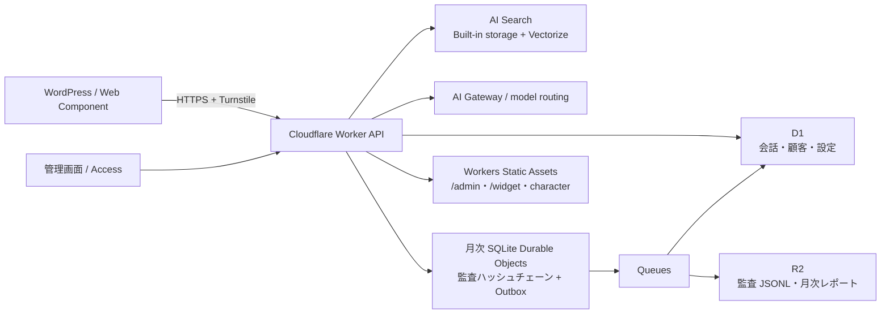

# アーキテクチャ

## 設計判断

1. ナレッジは AI Search の built-in storage にアップロードする。内部で R2 と Vectorize が管理され、PDF、Word、Excel、CSV、画像などを即時インデックスできる。
2. 回答前に AI Search の検索スコアを確認する。十分な根拠がない質問はモデルへ送らず回答を拒否する。
3. 禁止領域は決定論的ルールとシステムプロンプトの二段構えにする。価格交渉、法的判断、重要事項説明は常に拒否する。
4. 会話本文は PII をマスクして D1 に保存する。顧客情報は明示同意がある場合だけ別テーブルへ AES-GCM 暗号化して保存する。
5. 監査イベントは月単位に分割した SQLite Durable Object で直列化する。SHA-256 ハッシュチェーンと永続Outboxを同一トランザクションへ記録し、Queue 経由で D1 と R2 に複製する。管理画面から月次チェーンを再計算して欠損・改変を検知できる。
6. 管理画面は Cloudflare Access で保護し、API 側でも Access JWT を検証する。
7. 管理画面、WordPress用Web Component、キャラクター画像はWorker Static Assetsへ同梱する。Accessは `/admin/*` と `/api/admin/*` のみに適用し、`/api/chat/*` はTurnstileとRate Limitingで保護する。
8. 回答生成は `gpt-5-mini-2025-08-07` を Cloudflare AI Gateway `orient-chat` のBYOK経由で呼び出す。AI Searchの埋め込み、クエリ書換え、再ランキングはCloudflare上で完結させる。モデルは `GENERATION_MODEL` で切替可能。

## LLM 学習への利用防止

OpenAI APIはAPI入力・出力を既定でモデル学習に使用しない条件を採用し、リクエストには `store:false` を指定する。AI Gatewayのプロンプト・応答本文ログは無効、監査用のマスキング済み本文は自社D1/R2だけに保存する。OpenAI側の不正利用監視ログは通常最大30日で、Zero Data Retentionは別途審査・承認が必要。
